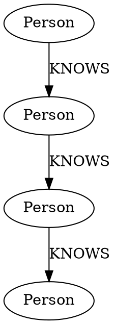
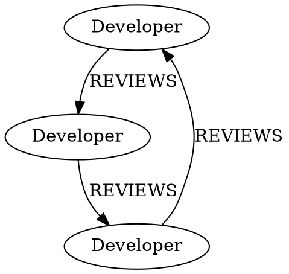
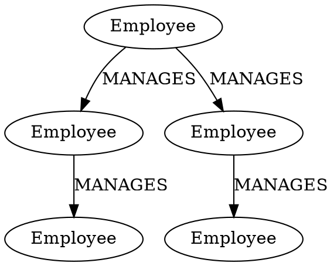
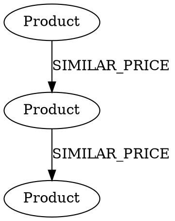
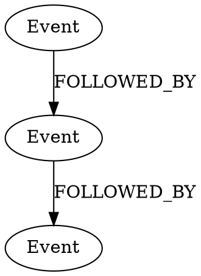
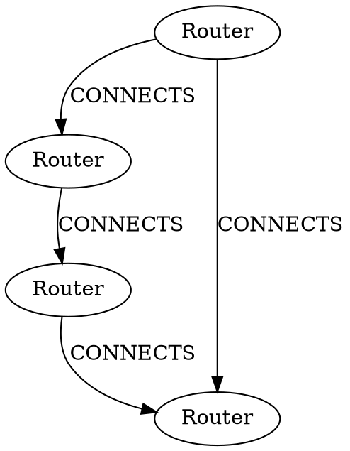

# Advanced Graph Patterns and Query Examples

## 1. Complex Relationship Patterns

### Pattern: Multi-hop Relationships
This pattern finds connections through multiple hops.



Neo4j Queries:
```cypher
// Find all connections up to 3 hops away
MATCH path = (start:Person {name: "John"})-[:KNOWS*1..3]->(connection)
RETURN path

// Find shortest path between two people
MATCH path = shortestPath((p1:Person {name: "John"})-[:KNOWS*]-(p2:Person {name: "Alice"}))
RETURN path

// Count number of connections at each hop level
MATCH (start:Person {name: "John"})-[:KNOWS*1..3]->(connection)
RETURN length(path) as hops, count(*) as connections
```

### Pattern: Cyclic Relationships
Finding cycles in the graph.



Neo4j Queries:
```cypher
// Find all review cycles
MATCH cycle = (dev:Developer)-[:REVIEWS*3]->(dev)
RETURN cycle

// Check if someone reviews their reviewer
MATCH (dev1:Developer)-[:REVIEWS]->(dev2:Developer)-[:REVIEWS]->(dev1)
RETURN dev1.name, dev2.name as reciprocal_reviewer
```

## 2. Hierarchical Data Patterns

### Pattern: Tree Structure
Managing hierarchical data like organizational charts.



Neo4j Queries:
```cypher
// Find all reports (direct and indirect) of a manager
MATCH (manager:Employee {name: "CEO"})-[:MANAGES*]->(report)
RETURN report.name, length(path) as level

// Find management chain for an employee
MATCH path = (employee:Employee {name: "Tech Manager"})<-[:MANAGES*]-(manager)
RETURN path

// Count employees at each level
MATCH path = (root:Employee {name: "CEO"})-[:MANAGES*]->(employee)
RETURN length(path) as level, count(*) as employees
```

## 3. Pattern: Complex Property Navigation

### Pattern: Property-Based Relationships
Finding patterns based on property values.



Neo4j Queries:
```cypher
// Find products within a price range
MATCH (p:Product)
WHERE toInteger(p.price) BETWEEN 700 AND 1000
RETURN p.name, p.price

// Find similar priced products
MATCH (p1:Product)-[r:SIMILAR_PRICE]->(p2:Product)
WHERE abs(toInteger(p1.price) - toInteger(p2.price)) <= toInteger(r.diff)
RETURN p1.name, p1.price, p2.name, p2.price

// Group products by price ranges
MATCH (p:Product)
WITH p, 
     CASE 
       WHEN toInteger(p.price) >= 1000 THEN 'High'
       WHEN toInteger(p.price) >= 500 THEN 'Medium'
       ELSE 'Low'
     END as priceRange
RETURN priceRange, collect(p.name) as products
```

## 4. Pattern: Temporal Data

### Pattern: Time-Based Relationships
Handling time-based data and relationships.



Neo4j Queries:
```cypher
// Find sequence of events within timeframe
MATCH (e1:Event)-[r:FOLLOWED_BY]->(e2:Event)
WHERE datetime(e1.time) < datetime(e2.time)
  AND duration.between(datetime(e1.time), datetime(e2.time)).minutes <= toInteger(r.delay)
RETURN e1.name, e2.name, r.delay

// Find events in time window
MATCH (e:Event)
WHERE datetime(e.time) >= datetime('2024-01-01 10:00')
  AND datetime(e.time) <= datetime('2024-01-01 10:30')
RETURN e.name, e.time
ORDER BY e.time

// Calculate time between events
MATCH (e1:Event)-[:FOLLOWED_BY*]->(e2:Event)
WHERE e1.name = 'Login' AND e2.name = 'Logout'
RETURN duration.between(datetime(e1.time), datetime(e2.time)).minutes as session_duration
```

## 5. Pattern: Graph Algorithms

### Pattern: Path Analysis
Using graph algorithms for analysis.



Neo4j Queries:
```cypher
// Find all paths between two points
MATCH path = (start:Router {name: 'A'})-[:CONNECTS*]->(end:Router {name: 'D'})
RETURN path

// Calculate path with minimum weight
MATCH path = (start:Router {name: 'A'})-[:CONNECTS*]->(end:Router {name: 'D'})
WITH path, reduce(weight = 0, r in relationships(path) | weight + toInteger(r.weight)) as total_weight
RETURN path, total_weight
ORDER BY total_weight ASC
LIMIT 1

// Find central nodes (high degree centrality)
MATCH (r:Router)
WITH r, size((r)-[:CONNECTS]-()) as connections
RETURN r.name, connections
ORDER BY connections DESC
```

Would you like me to:
1. Explain any of these patterns in more detail?
2. Show more examples of a specific type of pattern?
3. Add more complex query scenarios?

Let me also add a quick summary of when to use different patterns:

Multi-hop Relationships:

Use when finding indirect connections
Good for social networks, recommendation systems
Key Neo4j feature: variable-length paths with *


Cyclic Relationships:

Use for finding loops in data
Good for workflow validation, dependency checking
Key Neo4j feature: path functions


Hierarchical Data:

Use for org charts, category trees
Good for ancestry, file systems
Key Neo4j feature: recursive queries


Property-Based Navigation:

Use when relationships depend on property values
Good for product recommendations, similarity matching
Key Neo4j feature: WHERE clauses with property comparisons


Time-Based Patterns:

Use for event sequences, temporal data
Good for user sessions, transaction sequences
Key Neo4j feature: datetime functions