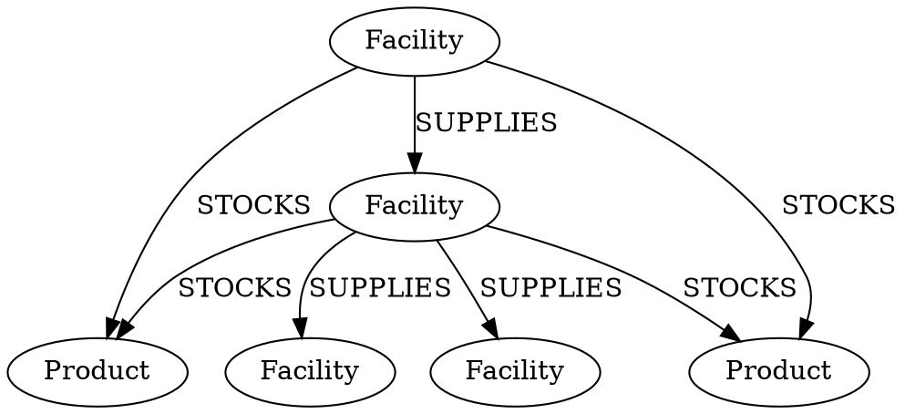
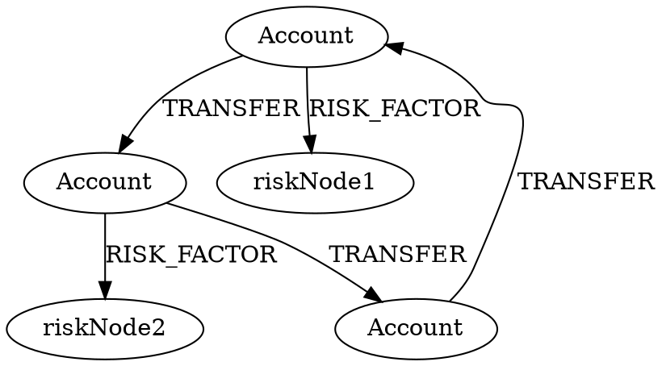
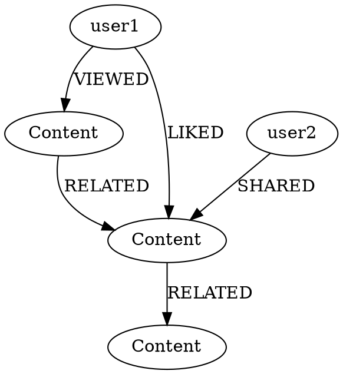

# Advanced Graph Scenarios and Optimizations

## 1. Supply Chain Management

### DOT Graph Structure


### Optimized Neo4j Queries

1. Inventory Tracking:
```cypher
// Create indexes for better performance
CREATE INDEX facility_name IF NOT EXISTS FOR (f:Facility) ON (f.name);
CREATE INDEX product_sku IF NOT EXISTS FOR (p:Product) ON (p.sku);

// Find total stock across all facilities
MATCH (f:Facility)-[s:STOCKS]->(p:Product {sku: "LP100"})
RETURN p.name, sum(toInteger(s.quantity)) as total_stock

// Find optimal supply route
MATCH path = shortestPath(
    (source:Facility {name: "Main Warehouse"})
    -[:SUPPLIES*]->
    (dest:Facility {name: "Store NYC"})
)
WITH path,
     reduce(cost = 0, r in relationships(path) | cost + toInteger(r.cost)) as total_cost,
     reduce(time = 0, r in relationships(path) | time + toInteger(replace(r.transport_time, 'd', ''))) as total_time
RETURN [node in nodes(path) | node.name] as route,
       total_cost,
       total_time
```

2. Supply Chain Analysis with Time Windows:
```cypher
// Using parameters for better performance
WITH $start_date as start_date, $end_date as end_date
MATCH (warehouse:Facility {type: "warehouse"})
      -[supply:SUPPLIES]->
      (store:Facility {type: "store"})
WHERE datetime(supply.last_shipment) >= datetime(start_date)
  AND datetime(supply.last_shipment) <= datetime(end_date)
WITH warehouse, store,
     count(supply) as shipment_count,
     avg(toInteger(supply.cost)) as avg_cost
RETURN warehouse.name,
       store.name,
       shipment_count,
       avg_cost
ORDER BY avg_cost DESC
```

## 2. Financial Transaction Network

### DOT Graph Structure


### Advanced Fraud Detection Queries

1. Cycle Detection (Money Laundering):
```cypher
// Find circular transaction patterns
MATCH path = (start:Account)-[:TRANSFER*3..5]->(start)
WHERE all(r in relationships(path) 
    WHERE datetime(r.timestamp) >= datetime().subtract(duration('P7D'))
)
WITH path,
     nodes(path) as accounts,
     relationships(path) as transfers
WHERE size(apoc.coll.toSet(accounts)) = size(accounts) - 1
RETURN accounts,
       [t in transfers | t.amount] as amounts,
       reduce(total = 0, t in transfers | total + toInteger(t.amount)) as total_volume
```

2. Risk Scoring with Graph Algorithms:
```cypher
// Calculate risk score using PageRank
CALL gds.pageRank.stream('financial_graph', {
    relationshipTypes: ['TRANSFER'],
    relationshipWeightProperty: 'amount'
})
YIELD nodeId, score
MATCH (a:Account) WHERE id(a) = nodeId
SET a.pagerank_score = score

// Find high-risk patterns
MATCH (a:Account)-[:TRANSFER*2..3]->(target:Account)
WHERE a.risk_score > 0.4
  AND target.pagerank_score > 0.6
RETURN DISTINCT a.id as source_account,
       target.id as target_account,
       a.risk_score,
       target.pagerank_score
```

## 3. Content Recommendation Engine

### DOT Graph Structure


### Optimized Recommendation Queries

1. Personalized Content Recommendations:
```cypher
// Using multiple relationship types for better recommendations
MATCH (user:User {id: $user_id})
      -[interaction:VIEWED|LIKED|SHARED]->
      (content:Content)
      -[r:RELATED]->
      (recommended:Content)
WHERE NOT (user)-[:VIEWED|LIKED|SHARED]->(recommended)
WITH recommended,
     sum(CASE type(interaction)
         WHEN 'VIEWED' THEN 1
         WHEN 'LIKED' THEN 2
         WHEN 'SHARED' THEN 3
         END * toFloat(r.strength)
     ) as score
RETURN recommended.id,
       recommended.type,
       score
ORDER BY score DESC
LIMIT 10

// Category-based recommendations with temporal decay
MATCH (user:User {id: $user_id})
      -[interaction:VIEWED|LIKED|SHARED]->
      (content:Content)
WHERE datetime(interaction.timestamp) >= datetime().subtract(duration('P30D'))
WITH user,
     content.category as category,
     sum(
         CASE type(interaction)
         WHEN 'VIEWED' THEN 1
         WHEN 'LIKED' THEN 2
         WHEN 'SHARED' THEN 3
         END *
         exp(
             -duration.between(
                 datetime(interaction.timestamp),
                 datetime()
             ).days / 30.0
         )
     ) as category_score
ORDER BY category_score DESC
LIMIT 3
MATCH (recommended:Content {category: category})
WHERE NOT (user)-[:VIEWED|LIKED|SHARED]->(recommended)
RETURN recommended.id,
       category,
       category_score
```

## Performance Optimization Tips

1. Index Creation:
```cypher
// Create composite indexes for frequently queried patterns
CREATE INDEX content_type_category IF NOT EXISTS
FOR (c:Content)
ON (c.type, c.category);

// Create full-text indexes for text search
CALL db.index.fulltext.createNodeIndex(
    "content_search",
    ["Content"],
    ["title", "description"]
);
```

2. Query Optimization:
```cypher
// Use parameters instead of literal values
MATCH (u:User {id: $user_id})
      -[r:VIEWED]->
      (c:Content)
WHERE datetime(r.timestamp) >= $start_date
RETURN c;

// Use EXPLAIN/PROFILE to analyze query performance
PROFILE
MATCH path = (start:User {id: "U1"})
             -[:VIEWED|LIKED*2..3]->
             (content:Content)
RETURN path;
```

3. Batch Processing:
```cypher
// Process large datasets in batches
CALL apoc.periodic.iterate(
    "MATCH (u:User) RETURN u",
    "WITH u
     MATCH (u)-[:VIEWED]->(c:Content)
     WITH u, count(c) as view_count
     SET u.total_views = view_count",
    {batchSize: 1000}
);
```

Would you like me to:
1. Add more complex scenarios?
2. Deep dive into specific optimization techniques?
3. Show more query patterns for any of these use cases?
4. Add more examples of real-world applications?