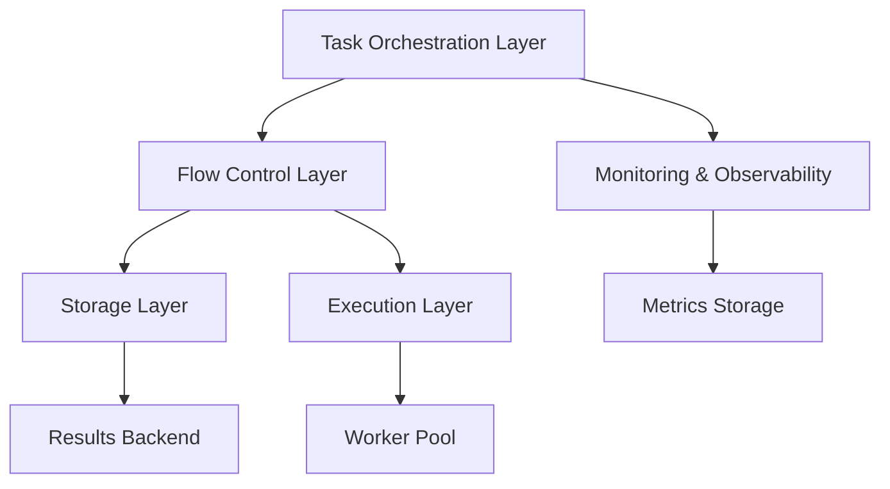

# Advanced Prefect Architecture: ETL Optimization & Best Practices

## Key Architectural Advantages Over Airflow

### 1. Dynamic Task Generation
Unlike Airflow's static DAG structure, Prefect allows dynamic task generation at runtime:
- Tasks can be created based on runtime conditions
- Flow structure can adapt to data availability
- Supports dynamic subflow spawning

### 2. Native Async Support
Prefect's native async/await support enables:
- True concurrent task execution
- Better resource utilization
- Reduced overhead compared to Airflow's executor model

### 3. State Management
Prefect's sophisticated state management provides:
- Fine-grained control over task retries and caching
- Built-in caching with customizable key functions
- Automatic state persistence and recovery

### 4. Modern Task Communication
Superior to Airflow's XCom:
- Type-safe task returns
- Direct task-to-task communication
- No serialization/deserialization overhead
- Support for large data volumes

### 5. Storage & Infrastructure
More flexible than Airflow:
- Infrastructure-agnostic design
- Cloud-native storage options
- No central database requirement
- Distributed execution by default

## Architectural Components

## Best Practices Implementation

1. **Task Granularity**
   - Atomic tasks for better retry handling
   - Task-specific resource allocation
   - Isolated failure domains

2. **State Management**
   - Cached intermediate results
   - Persisted task states
   - Intelligent retry mechanisms

3. **Resource Optimization**
   - Dynamic worker scaling
   - Task-specific resource allocation
   - Concurrent execution control

4. **Monitoring & Observability**
   - Integrated logging
   - Metrics collection
   - Performance tracking

## Performance Considerations

1. **Task Execution**
   - Async/await for I/O operations
   - Parallel task execution
   - Resource-aware scheduling

2. **Data Movement**
   - Minimized data transfers
   - Efficient state storage
   - Optimized caching strategies

3. **Resource Utilization**
   - Dynamic scaling
   - Load balancing
   - Resource quotas

## Security & Compliance

1. **Authentication & Authorization**
   - Role-based access control
   - Secure credential management
   - Audit logging

2. **Data Protection**
   - Encrypted storage
   - Secure communication
   - Data lineage tracking

Key differentiators from Airflow include:

True async/await support
Dynamic task generation
Type-safe task communication
Modern state management
Flexible deployment options
Resource-aware scheduling