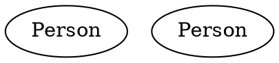
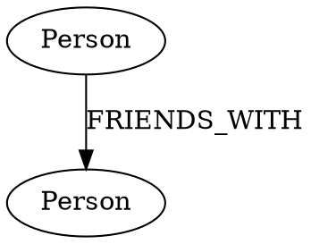
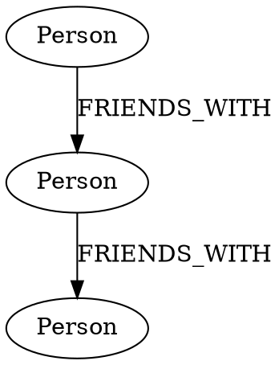
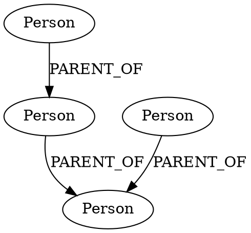
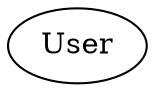
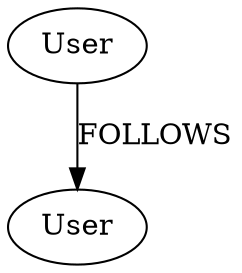

# Understanding DOT and Neo4j Patterns - A Simple Guide

## 1. Basic Node Creation

### In DOT:
DOT uses a simple format where you define nodes and then describe their properties in square brackets.



### In Neo4j:
Neo4j uses the CREATE command and curly braces for properties.

```cypher
// Simple node with label Person
CREATE (:Person)

// Node with properties
CREATE (:Person {name: "Mary", age: 30})
```

## 2. Creating Relationships

### In DOT:
DOT uses arrows (`->`) to show relationships between nodes.



### In Neo4j:
Neo4j uses arrow patterns with square brackets for relationship types.

```cypher
// Create two nodes and connect them
CREATE (john:Person {name: "John"})
CREATE (mary:Person {name: "Mary"})
CREATE (john)-[:FRIENDS_WITH]->(mary)
```

## 3. Simple Queries

### In DOT:
DOT is primarily for visualization, so it doesn't have query capabilities. You define what you want to see:



### In Neo4j:
Neo4j uses MATCH to find patterns in the graph:

```cypher
// Find all Person nodes
MATCH (p:Person) 
RETURN p

// Find friends of John
MATCH (john:Person {name: "John"})-[:FRIENDS_WITH]->(friend)
RETURN friend

// Find friends of friends
MATCH (john:Person {name: "John"})-[:FRIENDS_WITH]->(friend)-[:FRIENDS_WITH]->(friendOfFriend)
RETURN friendOfFriend
```

## 4. Real-World Example: Family Tree

### In DOT:


### In Neo4j:
```cypher
// Create family members
CREATE (:Person {name: "Joe", age: 70})
CREATE (:Person {name: "Mike", age: 45})
CREATE (:Person {name: "Sarah", age: 43})
CREATE (:Person {name: "Tim", age: 15})

// Create family relationships
MATCH (grandpa:Person {name: "Joe"})
MATCH (dad:Person {name: "Mike"})
CREATE (grandpa)-[:PARENT_OF]->(dad)

MATCH (dad:Person {name: "Mike"})
MATCH (child:Person {name: "Tim"})
CREATE (dad)-[:PARENT_OF]->(child)

MATCH (mom:Person {name: "Sarah"})
MATCH (child:Person {name: "Tim"})
CREATE (mom)-[:PARENT_OF]->(child)

// Query: Find Tim's parents
MATCH (child:Person {name: "Tim"})<-[:PARENT_OF]-(parent)
RETURN parent.name

// Query: Find Tim's grandparents
MATCH (grandparent:Person)-[:PARENT_OF]->(parent:Person)-[:PARENT_OF]->(child:Person {name: "Tim"})
RETURN grandparent.name
```

## 5. Key Differences

1. **Purpose**:
   - DOT: Visualization and documentation
   - Neo4j: Database storage and querying

2. **Direction**:
   - DOT: Can show both directed (`->`) and undirected (`--`) relationships
   - Neo4j: All relationships are directed but can be traversed both ways

3. **Properties**:
   - DOT: All values are strings
   - Neo4j: Supports multiple data types (strings, numbers, booleans, etc.)

4. **Querying**:
   - DOT: No querying capability (visualization only)
   - Neo4j: Rich query language (Cypher) for finding patterns

## 6. Simple Operations

### Creating a Node with Properties

DOT:


Neo4j:
```cypher
CREATE (:User {name: "John", age: 30})
```

### Creating a Relationship with Properties

DOT:


Neo4j:
```cypher
MATCH (john:User {name: "John"})
MATCH (mary:User {name: "Mary"})
CREATE (john)-[:FOLLOWS {since: "2023"}]->(mary)
```

This guide breaks down the basic patterns into simpler, digestible pieces. The key things to remember are:

DOT is for visualization:

Uses square brackets [] for properties
Uses arrows -> for relationships
Everything is defined within digraph {} blocks


Neo4j is for database operations:

Uses CREATE for creating nodes and relationships
Uses MATCH for finding patterns
Uses parentheses () for nodes and square brackets [] for relationships