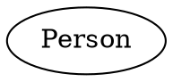
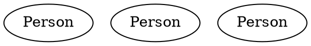
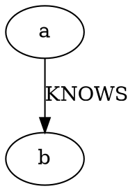
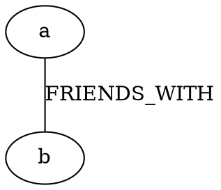
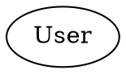
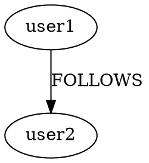
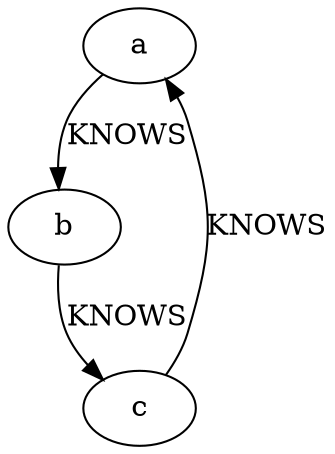
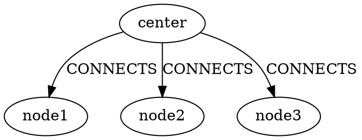
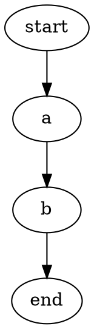
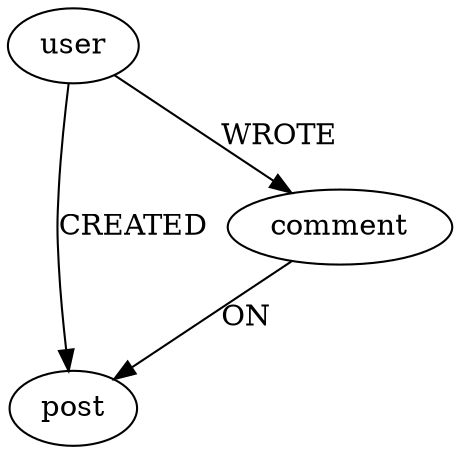

# DOT to Neo4j Pattern Conversions Guide

## 1. Basic Node Patterns

### Single Node

```cypher
// Neo4j
CREATE (:Person {name: "John"})
```

### Multiple Nodes

```cypher
// Neo4j
CREATE (:Person), (:Person), (:Person)
```

## 2. Relationship Patterns

### Simple Relationship

```cypher
// Neo4j
MATCH (a), (b)
CREATE (a)-[:KNOWS]->(b)
```

### Bidirectional Relationship

```cypher
// Neo4j
MATCH (a), (b)
CREATE (a)-[:FRIENDS_WITH]->(b),
       (b)-[:FRIENDS_WITH]->(a)
```

## 3. Property Patterns

### Node with Multiple Properties

```cypher
// Neo4j
CREATE (:User {
    name: "John",
    age: 30,
    city: "NYC"
})
```

### Relationship with Properties

```cypher
// Neo4j
MATCH (user1), (user2)
CREATE (user1)-[:FOLLOWS {
    since: "2023",
    active: true
}]->(user2)
```

## 4. Common Subgraph Patterns

### Triangle Pattern

```cypher
// Neo4j
CREATE (a:Person), (b:Person), (c:Person)
CREATE (a)-[:KNOWS]->(b),
       (b)-[:KNOWS]->(c),
       (c)-[:KNOWS]->(a)

// Finding triangles
MATCH (a)-[:KNOWS]->(b)-[:KNOWS]->(c)-[:KNOWS]->(a)
RETURN a, b, c
```

### Star Pattern

```cypher
// Neo4j
CREATE (center:Node)
CREATE (node1:Node), (node2:Node), (node3:Node)
CREATE (center)-[:CONNECTS]->(node1),
       (center)-[:CONNECTS]->(node2),
       (center)-[:CONNECTS]->(node3)

// Finding star patterns
MATCH (center)-[:CONNECTS]->(satellite)
RETURN center, collect(satellite) as satellites
```

## 5. Common Query Patterns

### Path Finding

```cypher
// Neo4j
// Find all paths
MATCH path = (start)-[*]->(end)
RETURN path

// Find shortest path
MATCH path = shortestPath((start)-[*]->(end))
RETURN path
```

### Pattern Matching

```cypher
// Neo4j
// Find users who created posts and wrote comments
MATCH (user:User)-[:CREATED]->(post:Post),
      (user)-[:WROTE]->(comment:Comment)-[:ON]->(post)
RETURN user, post, comment
```

These conversions show how:
1. DOT's visual patterns translate to Neo4j's query patterns
2. Properties are handled differently in each format
3. Relationships are defined and queried
4. Complex patterns can be represented in both formats

Would you like me to:
1. Add more specific conversion patterns?
2. Show more complex examples?
3. Explain any particular conversion in more detail?