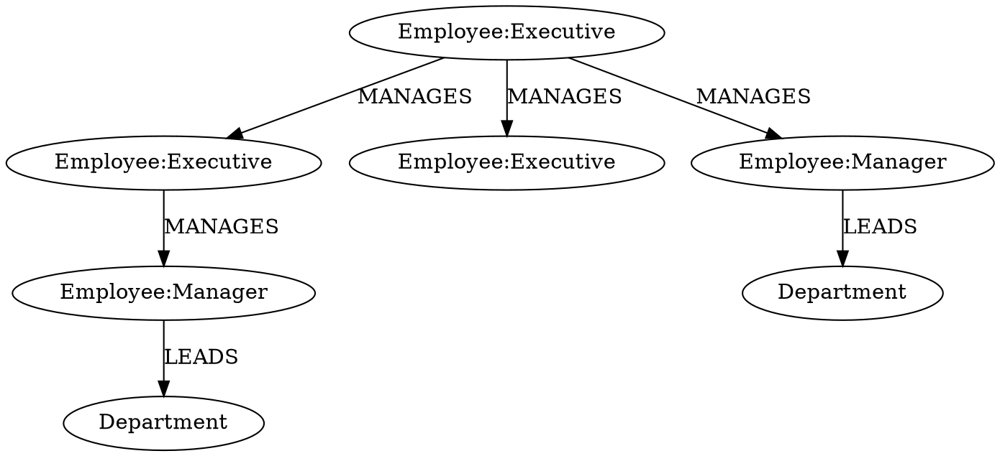
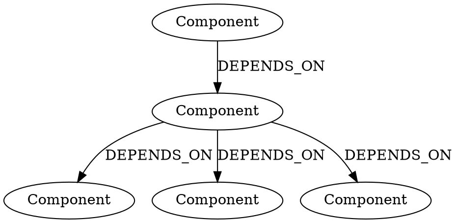
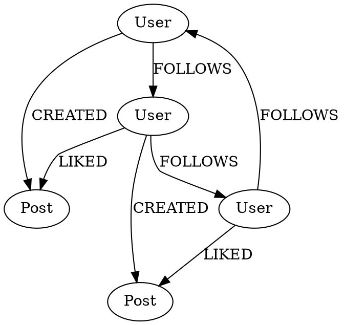

# Practical DOT and Neo4j Examples

## 1. Organization Structure

### DOT Version


### Neo4j Version
```cypher
// Create Executive Nodes
CREATE (:Employee:Executive {name: "John Doe", title: "CEO"})
CREATE (:Employee:Executive {name: "Jane Smith", title: "CTO"})
CREATE (:Employee:Executive {name: "Bob Wilson", title: "CFO"})

// Create Manager Nodes
CREATE (:Employee:Manager {name: "Alice Cooper", title: "IT Director"})
CREATE (:Employee:Manager {name: "Tom Brown", title: "HR Director"})

// Create Department Nodes
CREATE (:Department {name: "IT Department"})
CREATE (:Department {name: "HR Department"})

// Create Management Structure
MATCH (ceo:Employee {title: "CEO"})
MATCH (cto:Employee {title: "CTO"})
MATCH (cfo:Employee {title: "CFO"})
CREATE (ceo)-[:MANAGES]->(cto),
       (ceo)-[:MANAGES]->(cfo)

MATCH (cto:Employee {title: "CTO"})
MATCH (it_head:Employee {title: "IT Director"})
CREATE (cto)-[:MANAGES]->(it_head)

MATCH (ceo:Employee {title: "CEO"})
MATCH (hr_head:Employee {title: "HR Director"})
CREATE (ceo)-[:MANAGES]->(hr_head)

// Connect Departments
MATCH (it_head:Employee {title: "IT Director"})
MATCH (it_dept:Department {name: "IT Department"})
CREATE (it_head)-[:LEADS]->(it_dept)

MATCH (hr_head:Employee {title: "HR Director"})
MATCH (hr_dept:Department {name: "HR Department"})
CREATE (hr_head)-[:LEADS]->(hr_dept)
```

## 2. Project Dependencies

### DOT Version


### Neo4j Version
```cypher
// Create Components
CREATE (:Component {name: "Database", type: "storage"})
CREATE (:Component {name: "API Server", type: "service"})
CREATE (:Component {name: "User Interface", type: "frontend"})
CREATE (:Component {name: "Auth Service", type: "service"})
CREATE (:Component {name: "Cache Service", type: "service"})

// Create Dependencies
MATCH (ui:Component {name: "User Interface"})
MATCH (api:Component {name: "API Server"})
CREATE (ui)-[:DEPENDS_ON {protocol: "HTTP"}]->(api)

MATCH (api:Component {name: "API Server"})
MATCH (db:Component {name: "Database"})
CREATE (api)-[:DEPENDS_ON {protocol: "SQL"}]->(db)

MATCH (api:Component {name: "API Server"})
MATCH (auth:Component {name: "Auth Service"})
CREATE (api)-[:DEPENDS_ON {protocol: "gRPC"}]->(auth)

MATCH (api:Component {name: "API Server"})
MATCH (cache:Component {name: "Cache Service"})
CREATE (api)-[:DEPENDS_ON {protocol: "Redis"}]->(cache)
```

## 3. Social Network

### DOT Version


### Neo4j Version
```cypher
// Create Users
CREATE (:User {name: "Alice", age: 25})
CREATE (:User {name: "Bob", age: 30})
CREATE (:User {name: "Charlie", age: 28})

// Create Posts
CREATE (:Post {content: "Hello World", timestamp: "2024-01-22"})
CREATE (:Post {content: "Great day!", timestamp: "2024-01-22"})

// Create Follow Relationships
MATCH (alice:User {name: "Alice"})
MATCH (bob:User {name: "Bob"})
CREATE (alice)-[:FOLLOWS {since: "2023"}]->(bob)

MATCH (bob:User {name: "Bob"})
MATCH (charlie:User {name: "Charlie"})
CREATE (bob)-[:FOLLOWS {since: "2023"}]->(charlie)

MATCH (charlie:User {name: "Charlie"})
MATCH (alice:User {name: "Alice"})
CREATE (charlie)-[:FOLLOWS {since: "2024"}]->(alice)

// Create Post Relationships
MATCH (alice:User {name: "Alice"})
MATCH (post1:Post {content: "Hello World"})
CREATE (alice)-[:CREATED]->(post1)

MATCH (bob:User {name: "Bob"})
MATCH (post1:Post {content: "Hello World"})
CREATE (bob)-[:LIKED]->(post1)

MATCH (bob:User {name: "Bob"})
MATCH (post2:Post {content: "Great day!"})
CREATE (bob)-[:CREATED]->(post2)

MATCH (charlie:User {name: "Charlie"})
MATCH (post2:Post {content: "Great day!"})
CREATE (charlie)-[:LIKED]->(post2)
```

## 4. Common Queries for These Examples

### Organization Queries
```cypher
// Find all employees under CEO
MATCH (ceo:Employee {title: "CEO"})-[:MANAGES*]->(emp:Employee)
RETURN emp.name, emp.title

// Find department sizes
MATCH (dept:Department)<-[:LEADS]-(head:Employee)<-[:MANAGES*]-(emp:Employee)
RETURN dept.name, count(emp) as department_size

// Find management chain for an employee
MATCH path = (emp:Employee)-[:MANAGES*]->(target:Employee {name: "Alice Cooper"})
RETURN path
```

### Project Dependencies Queries
```cypher
// Find all dependencies of a component
MATCH (c:Component