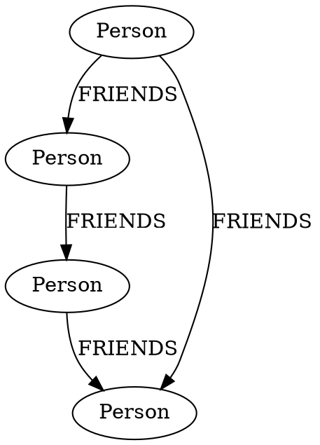
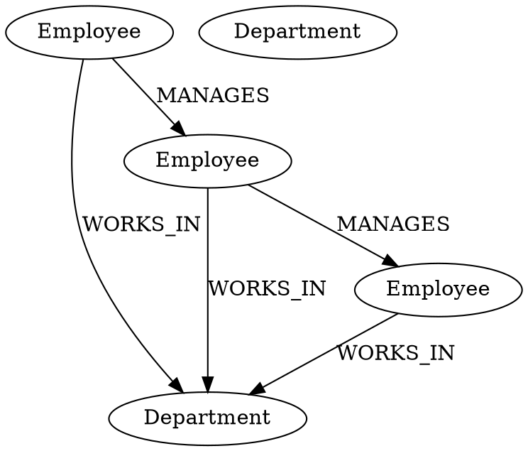
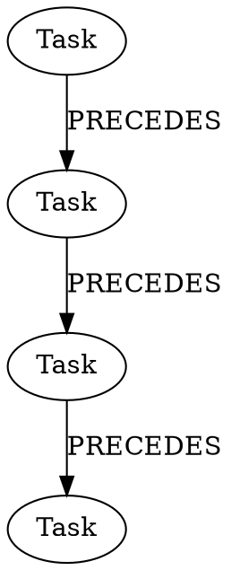
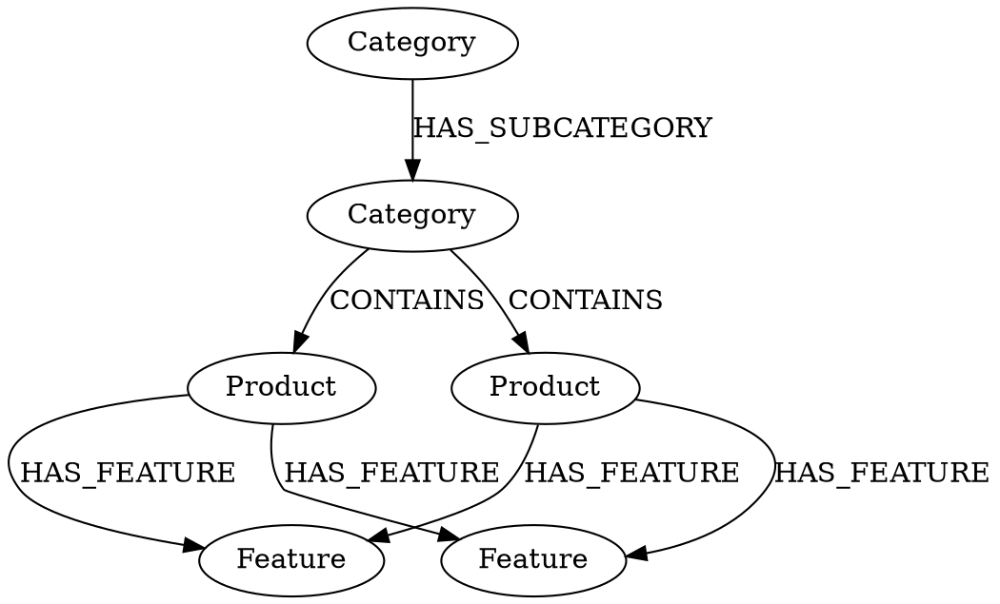
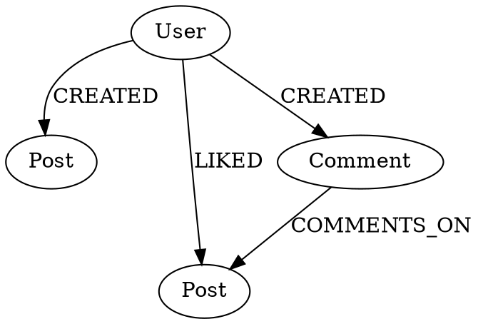

# Detailed Query Patterns in DOT and Neo4j

## 1. Finding Connected Nodes (Friend Network Example)

### DOT Representation


### Neo4j Queries
```cypher
// Find direct friends
MATCH (p:Person {name: "Alice"})-[:FRIENDS]->(friend)
RETURN friend.name

// Find friends of friends
MATCH (p:Person {name: "Alice"})-[:FRIENDS]->(friend)-[:FRIENDS]->(friendOfFriend)
WHERE friendOfFriend <> p  // Exclude original person
RETURN DISTINCT friendOfFriend.name

// Find shortest path between two people
MATCH path = shortestPath((p1:Person {name: "Alice"})-[:FRIENDS*]-(p2:Person {name: "David"}))
RETURN path
```

## 2. Hierarchical Data (Company Structure)

### DOT Representation


### Neo4j Queries
```cypher
// Find all employees in a department
MATCH (d:Department {name: "Sales"})<-[:WORKS_IN]-(e:Employee)
RETURN e.name, e.role

// Find management chain for an employee
MATCH path = (e:Employee {name: "Pete"})<-[:MANAGES*]-(manager:Employee)
RETURN path

// Find all subordinates (direct and indirect)
MATCH (manager:Employee {name: "John"})-[:MANAGES*]->(subordinate:Employee)
RETURN subordinate.name, subordinate.role

// Find employees with their managers and departments
MATCH (e:Employee)-[:WORKS_IN]->(d:Department)
OPTIONAL MATCH (e)<-[:MANAGES]-(manager:Employee)
RETURN e.name, e.role, d.name as department, manager.name as manager_name
```

## 3. Time-Based Relationships (Project Timeline)

### DOT Representation


### Neo4j Queries
```cypher
// Find all tasks and their dependencies
MATCH (t1:Task)-[r:PRECEDES]->(t2:Task)
RETURN t1.name, t2.name, r.lag

// Find critical path (tasks with no slack)
MATCH path = (start:Task)-[:PRECEDES*]->(end:Task)
WHERE NOT (start)<-[:PRECEDES]-()  // Start tasks
  AND NOT (end)-[:PRECEDES]->()    // End tasks
RETURN path

// Calculate total duration
MATCH (t:Task)
RETURN sum(toInteger(replace(t.duration, 'd', ''))) as total_days
```

## 4. Complex Relationships (Product Catalog)

### DOT Representation


### Neo4j Queries
```cypher
// Find products in a category (including subcategories)
MATCH (c:Category {name: "Electronics"})-[:HAS_SUBCATEGORY*]->(sub:Category)-[:CONTAINS]->(p:Product)
RETURN p.name, p.price

// Find common features between products
MATCH (p1:Product {name: "iPhone"})-[:HAS_FEATURE]->(f:Feature)
MATCH (p2:Product {name: "Galaxy"})-[:HAS_FEATURE]->(f)
RETURN f.name, f.specs

// Find product details with all features
MATCH (p:Product)-[:HAS_FEATURE]->(f:Feature)
RETURN p.name, collect({feature: f.name, specs: f.specs}) as features

// Find categories and their product counts
MATCH (c:Category)-[:HAS_SUBCATEGORY*0..]->(sub:Category)-[:CONTAINS]->(p:Product)
RETURN c.name, count(DISTINCT p) as product_count
```

## 5. Pattern Matching (User Activity)

### DOT Representation


### Neo4j Queries
```cypher
// Find user's activity timeline
MATCH (u:User {name: "Alice"})-[activity]->()
RETURN type(activity), activity.timestamp
ORDER BY activity.timestamp

// Find posts with their comment counts
MATCH (p:Post)<-[:COMMENTS_ON]-(c:Comment)
RETURN p.content, count(c) as comment_count

// Find users who both created and liked content
MATCH (u:User)-[:CREATED]->(p1:Post)
MATCH (u)-[:LIKED]->(p2:Post)
RETURN DISTINCT u.name

// Find user's interaction patterns
MATCH (u:User)-[r]->(content)
WHERE type(content) IN ["Post", "Comment"]
RETURN u.name, type(content), type(r), count(*) as count
```

These patterns demonstrate:
1. Basic node and relationship creation
2. Complex queries with multiple conditions
3. Path finding and traversal
4. Aggregation and counting
5. Pattern matching with multiple relationship types
6. Time-based queries
7. Hierarchical data traversal

Would you like me to:
1. Add more specific use cases?
2. Explain any of these patterns in more detail?
3. Show how to optimize these queries?