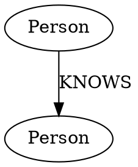
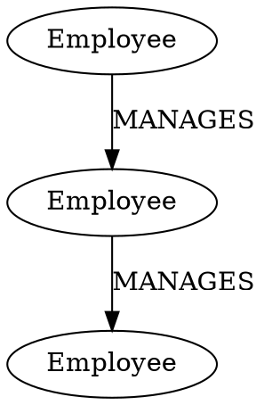

# Understanding DOT and Neo4j Graph Concepts

## Basic Graph Concepts

Both DOT and Neo4j are used to represent graphs, which consist of:
- **Nodes** (also called vertices): Represent entities
- **Edges** (also called relationships): Represent connections between entities
- **Properties**: Additional information attached to nodes or edges

## DOT (Graphviz) Overview

DOT is a plain text graph description language that's part of the Graphviz software. It's primarily used for visualization.

### DOT Syntax Basics

```dot
digraph G {
    // Node definition
    A [label="Person", name="John"]
    
    // Edge definition
    A -> B [label="KNOWS"]
    
    // Undirected edge
    C -- D
}
```

### Key DOT Elements

1. **Graph Types**:
   ```dot
   graph G {  }     // Undirected graph
   digraph G {  }   // Directed graph
   ```

2. **Node Definition**:
   ```dot
   node_id [attribute1="value1", attribute2="value2"]
   ```

3. **Edge Definition**:
   ```dot
   node1 -> node2   // Directed edge
   node1 -- node2   // Undirected edge
   ```

4. **Attributes**:
   ```dot
   [label="name", color="red", shape="box"]
   ```

## Neo4j Overview

Neo4j is a graph database that stores and manages graph data. It uses Cypher as its query language.

### Neo4j Key Concepts

1. **Nodes**:
   ```cypher
   CREATE (:Person {name: "John"})  // Create node with label and property
   ```
   - Enclosed in parentheses ()
   - Can have multiple labels
   - Properties stored in curly braces {}

2. **Relationships**:
   ```cypher
   CREATE (a:Person)-[:KNOWS]->(b:Person)  // Create relationship
   ```
   - Always have a direction (even if bidirectional)
   - Must have exactly one type
   - Can have properties

3. **Properties**:
   ```cypher
   CREATE (:Person {name: "John", age: 30})  // Node properties
   CREATE ()-[:KNOWS {since: 2020}]->()      // Relationship properties
   ```

## Mapping between DOT and Neo4j

### 1. Node Mapping

DOT:
```dot
A [label="Person", name="John"]
```

Neo4j:
```cypher
CREATE (:Person {name: "John"})
```

### 2. Edge/Relationship Mapping

DOT:
```dot
A -> B [label="KNOWS", since="2020"]
```

Neo4j:
```cypher
MATCH (a:Person), (b:Person)
CREATE (a)-[:KNOWS {since: "2020"}]->(b)
```

### 3. Special Considerations

#### Labels and Types
- DOT: Uses general attributes with "label"
- Neo4j: Has specific concepts for node labels and relationship types

#### Direction
- DOT: Both directed (`->`) and undirected (`--`) edges
- Neo4j: All relationships are technically directed, but can be traversed in both directions

#### Properties
- DOT: All attributes are strings
- Neo4j: Supports multiple data types (strings, numbers, booleans, arrays)

## Common Use Cases and Examples

### 1. Representing People and Relationships

DOT:


Neo4j:
```cypher
CREATE (:Person {name: "John"})
CREATE (:Person {name: "Mary"})
MATCH (john:Person {name: "John"}), (mary:Person {name: "Mary"})
CREATE (john)-[:KNOWS {since: "2020"}]->(mary)
```

### 2. Organization Structure

DOT:


Neo4j:
```cypher
CREATE (:Employee {title: "CEO"})
CREATE (:Employee {title: "CTO"})
CREATE (:Employee {title: "Developer"})
MATCH (ceo:Employee {title: "CEO"}), (cto:Employee {title: "CTO"})
CREATE (ceo)-[:MANAGES]->(cto)
MATCH (cto:Employee {title: "CTO"}), (dev:Employee {title: "Developer"})
CREATE (cto)-[:MANAGES]->(dev)
```

## Best Practices

1. **Naming Conventions**:
   - Use clear, consistent names for node labels and relationship types
   - Follow camelCase for property names in both formats

2. **Properties**:
   - Be consistent with property names across similar nodes/relationships
   - Use appropriate data types in Neo4j (don't store numbers as strings)

3. **Relationship Direction**:
   - Choose relationship directions that make semantic sense
   - Be consistent with relationship types across your graph

## Common Pitfalls

1. **DOT Limitations**:
   - All attributes are strings
   - No built-in support for multiple labels
   - Limited data validation

2. **Neo4j Considerations**:
   - Relationships must have a direction
   - Relationship types must be uppercase by convention
   - More strict typing system

## Conclusion

While both DOT and Neo4j represent graphs, they serve different purposes:
- DOT is primarily for visualization and documentation
- Neo4j is a full database system with querying capabilities

When converting between them, consider:
1. How to map DOT's flexible attributes to Neo4j's more structured format
2. How to handle DOT's undirected edges in Neo4j
3. Data type conversions and validation