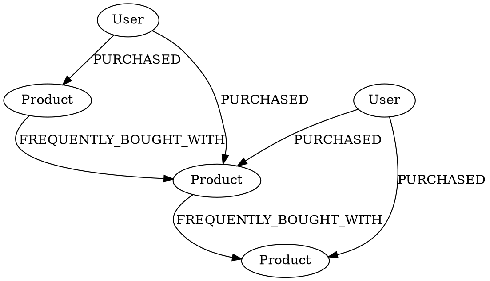
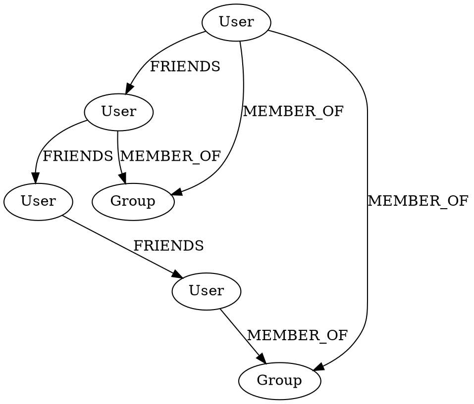
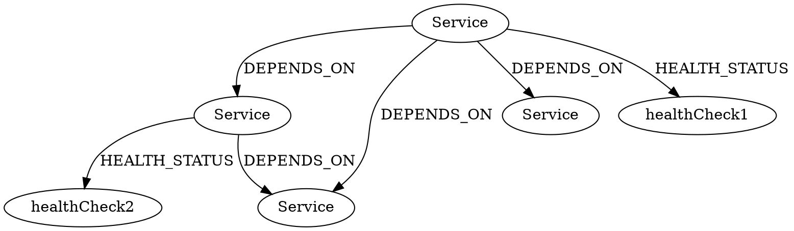
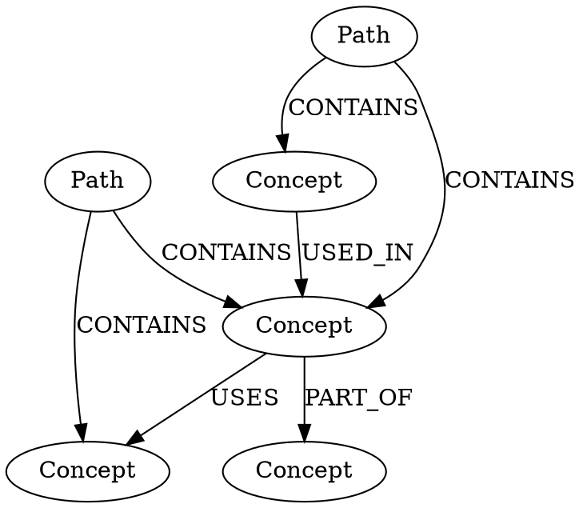

# Practical Graph Patterns with Real-World Examples

## 1. E-commerce Recommendation System

### DOT Graph


### Neo4j Queries

1. Find products frequently bought together:
```cypher
// Find direct product associations
MATCH (p1:Product)<-[:PURCHASED]-(u:User)-[:PURCHASED]->(p2:Product)
WHERE p1 <> p2
WITH p1, p2, count(*) as frequency
CREATE (p1)-[:FREQUENTLY_BOUGHT_WITH {strength: frequency * 1.0 / 
    // Normalize by total purchases
    MATCH (p:Product)<-[:PURCHASED]-()
    RETURN count(*)
}]->(p2)

// Get recommendations for a product
MATCH (p:Product {name: "Laptop"})-[r:FREQUENTLY_BOUGHT_WITH]->(recommended)
RETURN recommended.name, r.strength
ORDER BY r.strength DESC
```

2. Personalized recommendations:
```cypher
// Based on user's purchase history
MATCH (u:User {name: "John"})-[:PURCHASED]->(bought:Product)
MATCH (bought)-[:FREQUENTLY_BOUGHT_WITH]->(recommended:Product)
WHERE NOT (u)-[:PURCHASED]->(recommended)
RETURN recommended.name, count(*) as strength
ORDER BY strength DESC
```

## 2. Social Network Friend Suggestions

### DOT Graph


### Neo4j Queries

1. Find friends of friends:
```cypher
// Basic friend suggestions
MATCH (user:User {name: "Alice"})-[:FRIENDS]->(friend)-[:FRIENDS]->(fof:User)
WHERE NOT (user)-[:FRIENDS]->(fof)
AND user <> fof
RETURN fof.name, count(*) as common_friends
ORDER BY common_friends DESC

// Friend suggestions with common interests
MATCH (user:User {name: "Alice"})-[:FRIENDS]->(friend)-[:FRIENDS]->(fof:User)
WHERE NOT (user)-[:FRIENDS]->(fof)
AND user <> fof
WITH fof, count(*) as common_friends,
     [x in split(user.interests, ',') WHERE x in split(fof.interests, ',')] as shared_interests
RETURN fof.name, common_friends, shared_interests, size(shared_interests) as interest_count
ORDER BY common_friends DESC, interest_count DESC
```

2. Group-based suggestions:
```cypher
// Find users in same groups
MATCH (user:User {name: "Alice"})-[:MEMBER_OF]->(group:Group)<-[:MEMBER_OF]-(other:User)
WHERE NOT (user)-[:FRIENDS]->(other)
AND user <> other
RETURN other.name, collect(group.name) as common_groups
ORDER BY size(common_groups) DESC
```

## 3. Project Dependency Graph

### DOT Graph


### Neo4j Queries

1. Dependency analysis:
```cypher
// Find critical path (required dependencies)
MATCH path = (service:Service)-[:DEPENDS_ON*]->(dependency:Service)
WHERE service.name = "API"
AND ALL(r IN relationships(path) WHERE r.required = "true")
RETURN path

// Find service impact
MATCH (impacted:Service)-[:DEPENDS_ON*]->(service:Service {name: "Database"})
RETURN impacted.name as affected_service,
       length(path) as dependency_depth
ORDER BY dependency_depth
```

2. Health monitoring:
```cypher
// Check system health
MATCH (s:Service)-[h:HEALTH_STATUS]->(check)
WITH s, h.status as status
MATCH (s)<-[:DEPENDS_ON*0..]-(dependent:Service)
WHERE h.status <> "healthy"
RETURN s.name as problem_service,
       collect(DISTINCT dependent.name) as affected_services
```

## 4. Knowledge Graph

### DOT Graph


### Neo4j Queries

1. Find learning paths:
```cypher
// Get complete learning path
MATCH path = (p:Path {name: "Beginner"})-[r:CONTAINS]->(c:Concept)
RETURN c.name as concept,
       r.order as learn_order
ORDER BY r.order

// Find prerequisites
MATCH (concept:Concept {name: "Django"})<-[:USED_IN]-(prereq:Concept)
RETURN prereq.name as prerequisite
```

2. Knowledge exploration:
```cypher
// Find related concepts
MATCH (c:Concept {name: "Django"})-[r]->(related:Concept)
RETURN type(r) as relationship,
       related.name as related_concept

// Find concept usage
MATCH (c:Concept)-[:USED_IN|PART_OF|USES*1..3]->(usage)
WHERE c.name = "Python"
RETURN usage.name as used_in,
       length(path) as distance
```

Would you like me to:
1. Add more specific examples for any of these patterns?
2. Show more complex queries?
3. Explain how to optimize these queries for better performance?
4. Add more real-world use cases?

I've created a detailed guide with real-world examples. Each example shows:

How to structure the data in DOT format
How to query it in Neo4j
Common use cases and patterns